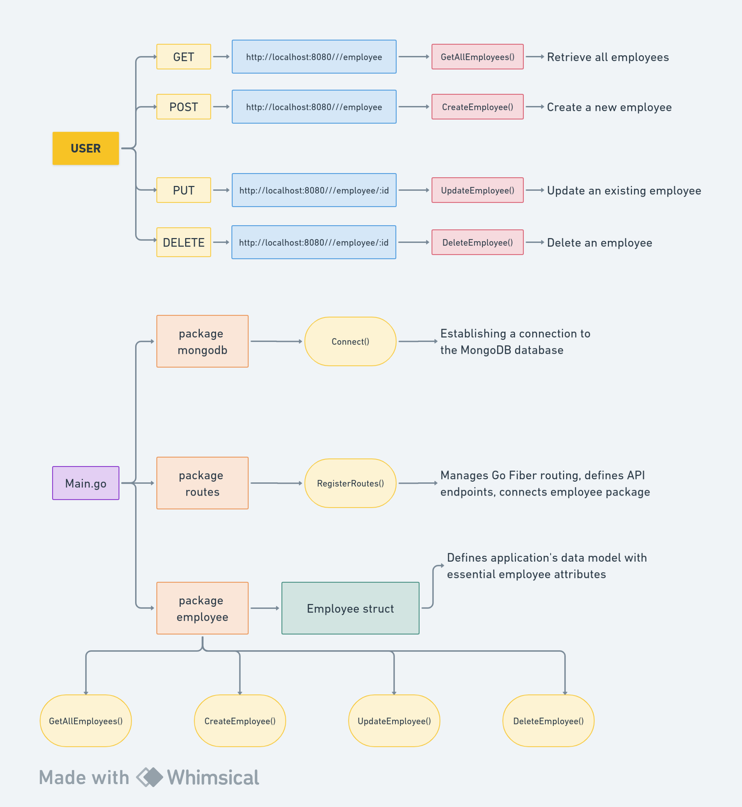

# MongoDB Human Resource Management System
The MongoDB Human Resource Management System aims to streamline employee data management using a web-based interface. It facilitates the creation, retrieval, updating, and deletion of employee records, providing a user-friendly solution for managing human resources within an organization. The system leverages MongoDB for efficient data storage and retrieval, enhancing scalability and performance.


## Project Overview Through A Diagram


## Prerequisites
Before you begin, ensure you have the following installed on your machine:
- [Go](https://golang.org/dl/): The Go programming language
- [MongoDB](https://docs.mongodb.com/manual/installation/): MongoDB database

## Guide
Follow the steps below to set up and run the MongoDB Human Resource Management System locally:

### 1. Clone the Repository
```bash
git clone https://github.com/panchanandevops/MongoDB-HRMS-Project.git
cd MongoDB-HRMS-Project
```

### 2. Install Dependencies
```bash
go mod tidy
```

### 3. Configure MongoDB
Make sure MongoDB is running, and update the connection details in `internal/mongodb/mongo.go` if needed.

### 4. Run the Project
```bash
go run main.go
```

## Endpoints
List and describe the available API endpoints and their functionalities.

- **GET /employee**: Retrieve all employees.
- **POST /employee**: Create a new employee.
- **PUT /employee/:id**: Update an existing employee.
- **DELETE /employee/:id**: Delete an employee.


## Run the application through Docker-Compose

```bash
docker compose -p Go-HRMS up --build -d
```

Here  `-p` for `--Project-name`.
